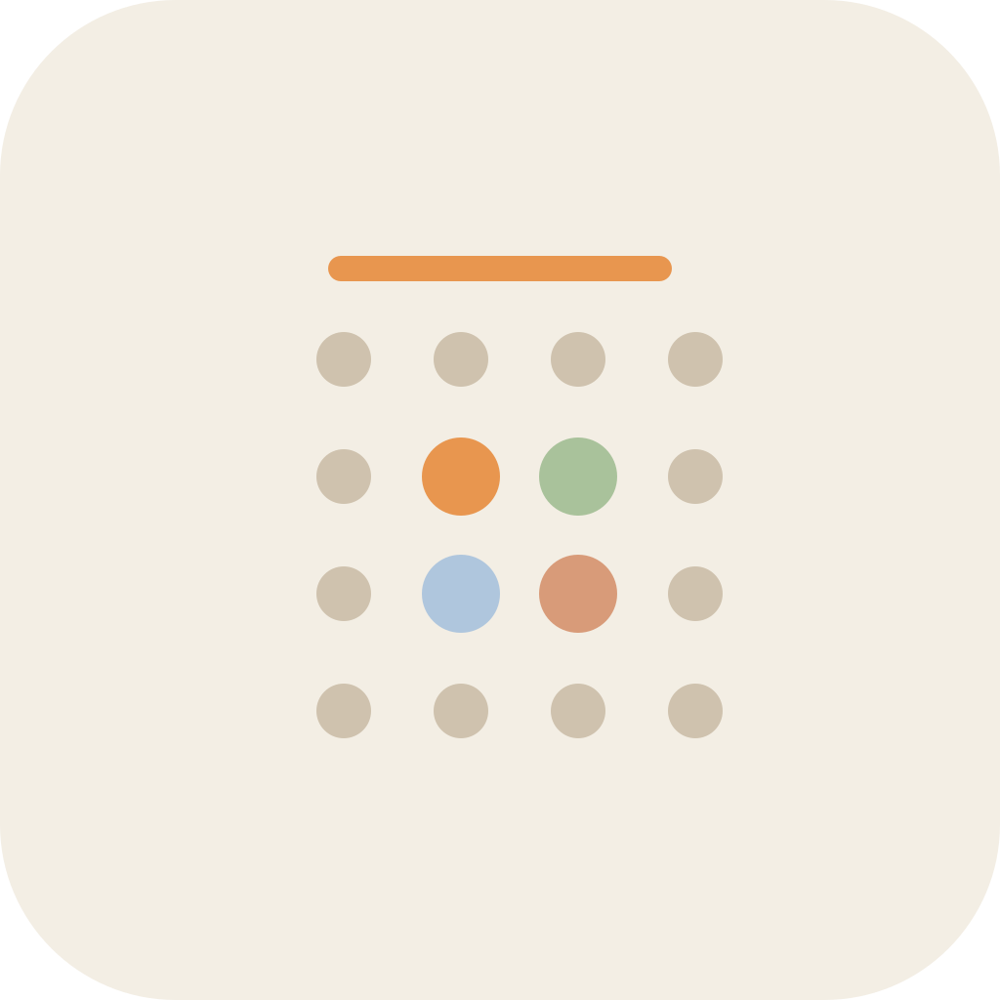

# App-Icons – „Unser Familien-Organizer"

Sechs flache, minimale Icon-Konzepte zur Auswahl. Motiv: **Kalender + Familie/Personen**,
Markenfarben aus der App (Orange `#E8964F`, Creme `#F3EEE4`, Braun `#3E322A`, Sage `#A9C29B`,
Sky `#AFC6DD`, Terracotta `#D89B79`).

Jedes Icon ist 1024×1024 (Quelle als SVG, gerendert als PNG). Sag mir einfach die **Nummer**
deines Favoriten – dann baue ich ihn als richtiges App-Icon ein (Android adaptive + Windows
`.ico` + Linux) und mache ein neues Test-Release.

| # | Vorschau | Konzept |
|---|----------|---------|
| 1 |  | **Kalender + Mitglieder-Punkte.** Weißes Kalenderblatt, orange Kopfleiste, vier farbige Punkte (Orange/Sage/Blau/Terracotta) wie die Mitglieder-Legende. Creme-Hintergrund. |
| 2 |  | **Kalender + Herz.** Gleiches Blatt, aber ein warmes Herz als „Tag" – Familie & Zuneigung. |
| 3 |  | **Familienkreis.** Drei abstrakte Figuren (Elternteil + zwei Kinder) in Mitgliederfarben, ohne Kalender – sehr klar als „Familie" lesbar. |
| 4 |  | **Familie auf dem Kalenderblatt.** Kombiniert beide Motive: drei Figuren stehen auf der Kalenderfläche. |
| 5 |  | **Kontrast-Variante (oranger Hintergrund).** Konzept 1 invertiert – oranger Grund, cremefarbenes Blatt, braune Kopfleiste. Knalliger Launcher-Look. |
| 6 |  | **Monats-Punktraster.** Gedämpftes Punktraster eines Monats, in der Mitte bilden vier farbige Punkte eine kleine Familie. Sehr minimal. |

## Meine Empfehlung

- **Konzept 1** – am eindeutigsten „Familienkalender", sauber, skaliert gut auf kleine Größen.
- **Konzept 5** – falls es im Launcher mehr knallen soll (oranger Hintergrund sticht heraus).
- **Konzept 3** – wenn der Fokus klar auf „Familie" statt „Kalender" liegen soll.

Quelldateien: `concept-1.svg` … `concept-6.svg` (editierbar, falls du Feinschliff möchtest).
